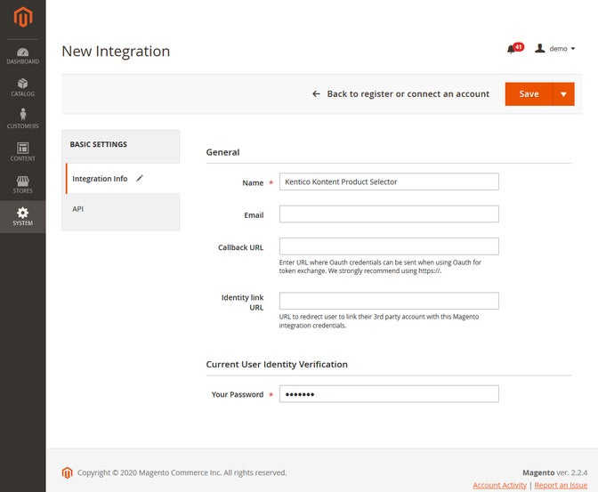
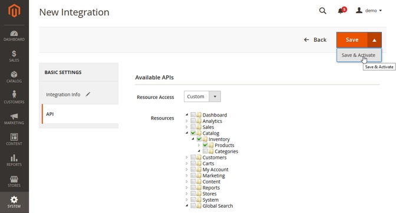

[![Core integration][core-shield]](https://kontent.ai/integrations/magento)

![Last modified][last-commit]
[![Issues][issues-shield]][issues-url]
[![Contributors][contributors-shield]][contributors-url]
[![Forks][forks-shield]][forks-url]
[![MIT License][license-shield]][license-url]

[![Stack Overflow][stack-shield]](https://stackoverflow.com/tags/kontent-ai)
[![Discord][discord-shield]](https://discord.gg/SKCxwPtevJ)

<p align="center">
<image src="docs/kai-logo-hor-pos-rgb.svg" alt="kontent logo" width="290" />
<image src="docs/magento-logo.png" 
alt="magento logo" width="300">
</p>

<p align="center">
  <a href="#features">Features</a> •
  <a href="#demo">Demo</a> •
  <a href="#quick-deploy">Deploy</a> •
  <a href="#setup">Setup</a> •
  <a href="#what-is-saved">Saved value</a> •
  <a href="#contributors">Contributors</a> •
  <a href="#license">License</a> •
  <a href="#additional-resources">Resources</a>
</p>

This repository contains the source code of Magento product selector custom element for Kontent.ai. 

It also includes a node.js proxy function (see [Netlify functions](https://docs.netlify.com/functions/overview/)) that routes requests from the element to your Magento instance while adding required authentication. 

## Features
This  [custom element](https://docs.kontent.ai/tutorials/develop-apps/integrate/integrating-your-own-content-editing-features) allows the user to search and link products from their [Magento e-commerce](https://magento.com/) instance into [Kontent.ai](https://kontent.ai).

- Editors can
  - Search for products in Magento commerce
  - Select a single product (or one of it's variants)

## Demo

![Demo Animation][product-demo]

## Getting started

### Quick Deploy

Netlify has made this easy. If you click the deploy button below, it will guide you through the process of deploying it to Netlify and leave you with a copy of the repository in your account as well.

[](https://app.netlify.com/start/deploy?repository=https://github.com/kontent-ai/custom-element-magento)

### Running manually

You will need to [deploy](https://docs.netlify.com/functions/deploy/?fn-language=ts) the [Netlify function](https://docs.netlify.com/functions/overview/) in the `src/functions` directory.
Or [run it locally](https://docs.netlify.com/functions/build/#test-locally).

The integration's custom element is created with [Create React App](https://create-react-app.dev/). First you will need to install npm dependencies with `npm install`. Then use `npm run build` to build the integration or `npm run start` to start a local development server. See https://create-react-app.dev/docs/available-scripts for more scripts.

## Setup
1. ### Create a new Integration inside of your Magento Instance

_If you don't have a Magento account, you can leverage the public Magento demo available at mageplaza.com._

- Navigate to the Magento admin and select System from the main menu. Our custom product selector will run outside of Magento so you need to register it as an integration.
- Select **Integrations** from the sub-menu and create a new integration.
- Fill out the **Integratino info** as you see fit



- Select the **API** tab and configure the following:
  - From the **Resource** access dropdown, select **Custom**.
  - Select the following options: **Catalog > Inventory > Products**.



> **⚠ WARNING: The extension does not require any special permissions but to read your product data. Keep in mind it is always better to keep the necessary permissions to a minimum for security reasons.**

- Choose the **Save & Activate** option from the Save button.
- Copy the **access token** as you will need it in the next step. 

At this point, the Magento Product API can be queried for products provided that the call includes the access token you just created.

2. ### Netlify/server setup
    Since you don't want to store the API secret inside the custom element config, we are using [Netlify function](https://docs.netlify.com/functions/overview/) to act as a proxy between your custom element and the Magento Product API. In order to make the function work, you'll need to provide it with the **Secret** you obtained in the previous step. For that, we'll use Netlify's [Build enrionment variable](https://docs.netlify.com/configure-builds/environment-variables/). The only issue with these variables are that they are being loaded on build, so whenever you **change the variables**, you'll need to **manually trigger a rebuild**. 

    The expected variable name for the function is `MAGENTO_TOKEN`.

    How this all can be done is described in our [Kontent.ai-Netlify example repository](https://github.com/kontent-ai/netlify-webhook-processor#setup), or can be observed on the animation below (_a different API example was used in the animation_).


3. ### Configure the Custom Element 
    After your function is setup, you'll need to create and configure your Magento custom element. The process of adding a custom element into your project is described in [Kontent.ai's official documentation](https://docs.kontent.ai/tutorials/develop-apps/integrate/content-editing-extensions). 

    The custom element has to be also configured. The necessary configuration values are as follows:

```
{
    "storeUrl": "<YOUR MAGENTO DOMAIN>",
    "urlKeyAttribute": "url_key"
}
```
Note that **urlKeyAttribute** is optional, if not provided, it will be automatically generated with the value shown above.

_The url of the Netlify function should be equal to your custom element's Hosted URL with `/.netlify/functions/magento-client` added to it (if you are using the provided quick deploy). If not, you'll have to update the code of the custom element._

## What is Saved
The element will contain a json object describing your selected Magento product. See example below:

```
{
  "id": 37,
  "title": "Endurance Watch",
  "previewUrl": "https://my-store/pub/media/catalog/product/37.jpg",
  "sku": "37-MG01",
  "urlKey": "endurance-watch"
}
```

## Contributors
<a href="https://github.com/kontent-ai/custom-element-magento/graphs/contributors">
  
</a>

We have collected notes on how to contribute to this project in [CONTRIBUTING.md](CONTRIBUTING.md).

## License

[MIT](https://tldrlegal.com/license/mit-license)

## Additional Resources

- [Kontent.ai's Integration documentation](https://docs.kontent.ai/tutorials/develop-apps/integrate/integrations-overview)
- [Custom Element documentation](https://docs.kontent.ai/tutorials/develop-apps/integrate/content-editing-extensions)
- [Custom Element API reference](https://docs.kontent.ai/reference/custom-elements-js-api)


[last-commit]: https://img.shields.io/github/last-commit/kontent-ai/custom-element-magento?style=for-the-badge
[contributors-shield]: https://img.shields.io/github/contributors/kontent-ai/custom-element-magento.svg?style=for-the-badge
[contributors-url]: https://github.com/kontent-ai/custom-element-magento/graphs/contributors
[forks-shield]: https://img.shields.io/github/forks/kontent-ai/custom-element-magento.svg?style=for-the-badge
[forks-url]: https://github.com/kontent-ai/custom-element-magento/network/members
[stars-shield]: https://img.shields.io/github/stars/kontent-ai/custom-element-magento.svg?style=for-the-badge
[stars-url]: https://github.com/kontent-ai/custom-element-magento/stargazers
[issues-shield]: https://img.shields.io/github/issues/kontent-ai/custom-element-magento.svg?style=for-the-badge
[issues-url]: https://github.com/kontent-ai/custom-element-magento/issues
[license-shield]: https://img.shields.io/github/license/kontent-ai/custom-element-magento.svg?style=for-the-badge
[license-url]: https://github.com/kontent-ai/custom-element-magento/blob/master/LICENSE
[core-shield]: https://img.shields.io/static/v1?label=&message=core%20integration&color=FF5733&style=for-the-badge
[stack-shield]: https://img.shields.io/badge/Stack%20Overflow-ASK%20NOW-FE7A16.svg?logo=stackoverflow&logoColor=white&style=for-the-badge
[discord-shield]: https://img.shields.io/discord/821885171984891914?label=Discord&logo=Discord&logoColor=white&style=for-the-badge
[product-demo]: docs/demo.gif?raw=true
